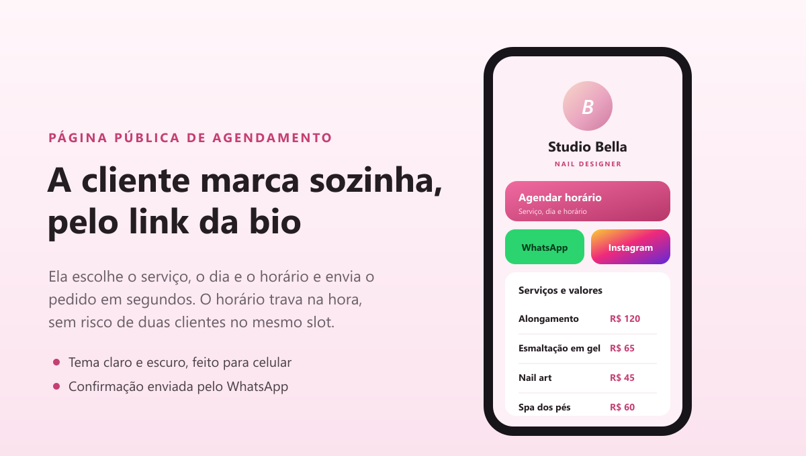
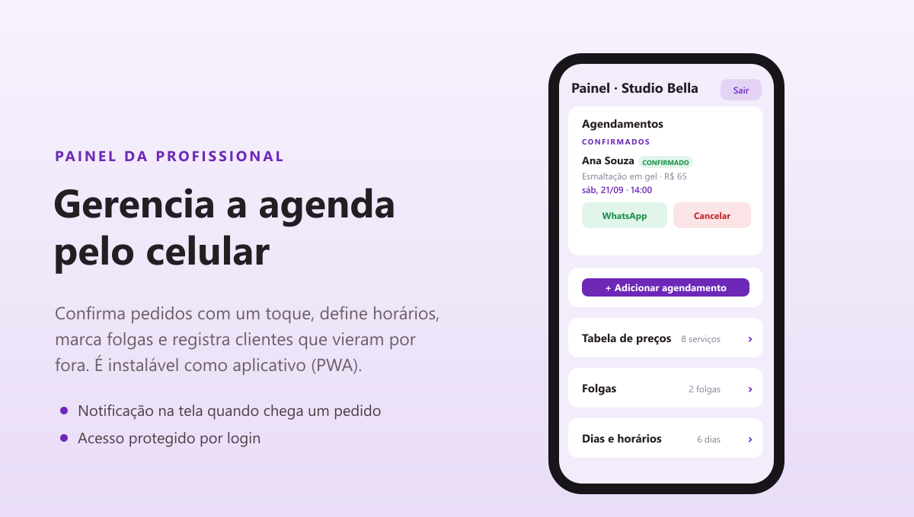

# Carin Oliveira — Agendamento online para nail designer

Sistema de "link na bio" com agendamento próprio, feito para uma nail designer. A cliente marca o horário sozinha pelo link do Instagram e a profissional gerencia tudo por um painel no celular. O sistema está em produção e roda com custo zero.

## Telas

As imagens abaixo usam dados fictícios (estúdio "Studio Bella").





## O problema

A profissional atende com hora marcada, mas os agendamentos chegavam soltos: uns pelo WhatsApp, outros numa agenda de papel. Isso gera três dores comuns nesse tipo de negócio:

- mensagens de agendamento se perdem no meio das conversas;
- risco de marcar duas clientes no mesmo horário;
- nenhuma visão organizada da agenda do dia e da semana.

## A solução

Uma página única (no estilo "link na bio") que a profissional coloca na bio do Instagram. A cliente escolhe o serviço, o dia e o horário e envia o pedido. Aquele horário fica indisponível na mesma hora para as outras clientes. A profissional confirma pelo painel, e a mensagem de confirmação chega pronta no WhatsApp da cliente.

## Como funciona

1. A cliente abre o link e escolhe um ou mais serviços, o dia e o horário.
2. Preenche nome e WhatsApp e envia o pedido.
3. O horário sai da agenda pública na mesma hora, evitando duplicidade.
4. A profissional recebe uma notificação e vê o pedido no painel.
5. Confirma ou recusa com um toque; a mensagem para a cliente abre pronta no WhatsApp.

## Funcionalidades

- Agendamento online com trava de horário, sem risco de duas clientes no mesmo slot
- Painel da profissional, instalável como aplicativo (PWA) e com acesso protegido por login
- Notificações push quando chega um pedido, funcionando inclusive no iPhone
- Confirmação, recusa e cancelamento com mensagem pronta no WhatsApp
- Tabela de preços editável, com serviços em destaque
- Definição dos dias e horários de atendimento
- Folgas: bloqueio de datas específicas por um calendário
- Agendamento manual, para registrar clientes que marcaram por fora
- Página pública responsiva, com tema claro e escuro

## Stack

- Next.js (App Router) e TypeScript
- React e Tailwind CSS
- Firebase: Firestore (banco em tempo real), Authentication e Cloud Messaging (push)
- Rota de API no servidor (Vercel) com Firebase Admin para enviar as notificações
- Vitest para os testes automatizados
- Deploy na Vercel

Roda inteiramente no plano gratuito dos serviços, o que mantém o custo de operação em zero.

## Decisões técnicas

- Trava de horário sem servidor pago. Cada horário vira um documento com identificador determinístico (data mais hora). As regras de segurança só permitem criar, nunca sobrescrever, então duas pessoas não conseguem pegar o mesmo horário. Não foi preciso usar funções de servidor pagas.
- Separação de dados. Os dados da cliente (privados) ficam numa coleção que só a dona lê. A agenda pública guarda apenas data, hora e status, sem expor quem marcou.
- Notificação no iPhone. O push web no iOS é mais restrito; a mensagem é enviada no formato que o próprio sistema exibe, com o aplicativo instalado na tela inicial.
- Pensado para reaproveitar. Os dados do negócio ficam separados do "motor" da aplicação, com a ideia de virar um produto para outros profissionais.

## Qualidade

- Testes automatizados com Vitest nas funções principais
- Documentação de arquitetura, fluxo e decisões na pasta `docs`
- Histórico de commits organizado, uma entrega de cada vez

## Como rodar

```bash
npm install
npm run dev     # ambiente de desenvolvimento em http://localhost:3000
npm run build   # build de produção
npm run test    # testes automatizados
```

As chaves do Firebase ficam em variáveis de ambiente (`.env.local`), fora do repositório.

## Estrutura

```
src/app/          rotas (site público, painel /admin e a API de notificações)
src/components/   componentes de interface
src/lib/          camada de dados (Firestore), utilidades e mensagens
docs/             documentação (arquitetura, fluxo, decisões, roadmap)
public/           arquivos estáticos (ícones e manifest do PWA)
```
