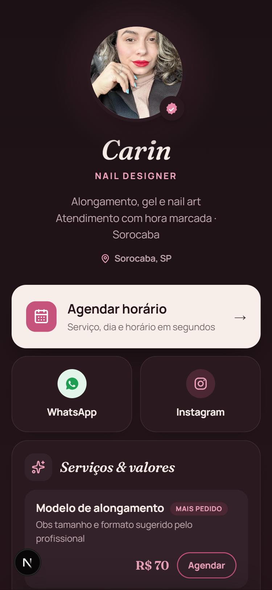
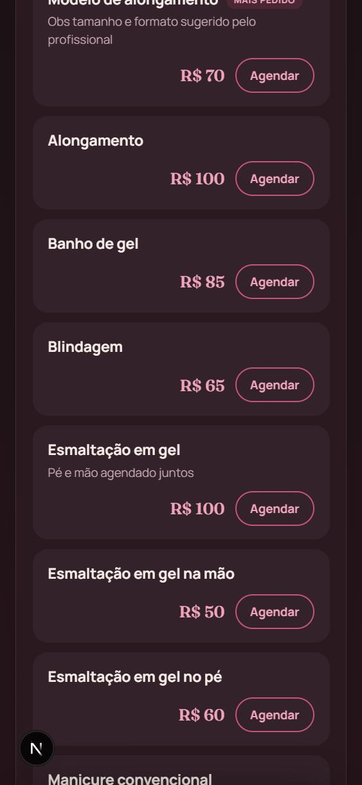
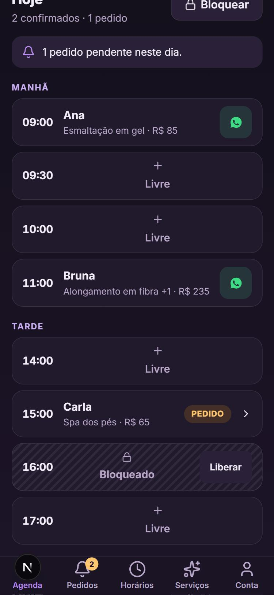
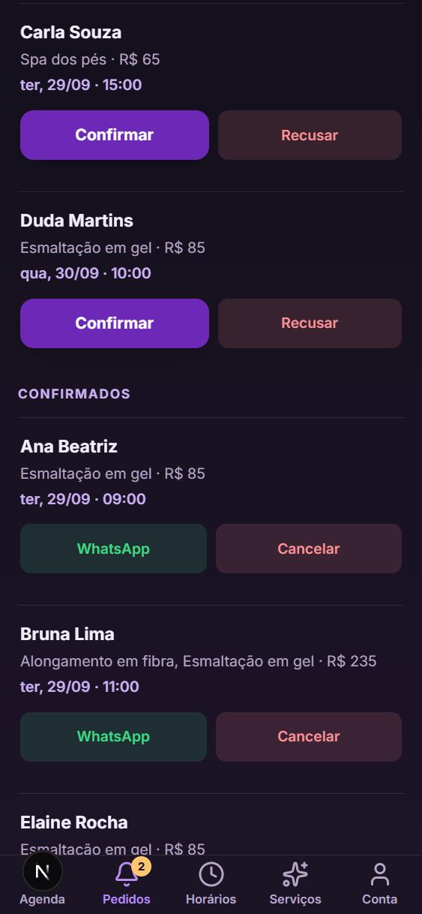

<div align="center">


# Carin Oliveira

**Agendamento online para nail designer, direto do link do Instagram.**

Sistema de "link na bio" com agendamento próprio: a cliente marca o horário sozinha e a profissional gerencia tudo por um painel no celular. Está em produção e roda com custo zero.

<br />


<sub>Em uso real por uma profissional. O endereço do site não é divulgado aqui, para preservar a privacidade da cliente.</sub>

<br />


</div>

<br />

## Sobre o projeto

Uma nail designer atende com hora marcada, mas os pedidos chegavam soltos: alguns pelo WhatsApp, outros numa agenda de papel. O resultado era o problema de quem vive de agenda: mensagem de agendamento que se perde no meio das conversas, risco de marcar duas clientes no mesmo horário e nenhuma visão organizada do dia e da semana.

A solução é uma página única, no estilo "link na bio", que a profissional coloca no Instagram. A cliente escolhe o serviço, o dia e o horário e envia o pedido, e aquele horário some na hora para as outras clientes. A profissional recebe uma notificação, confirma ou recusa pelo painel com um toque, e a mensagem para a cliente abre pronta no WhatsApp.

O diferencial está no cuidado com o dia a dia e com o custo. A trava de horário funciona sem servidor pago, só com regras de segurança e um identificador único por horário. No agendamento manual, quando a profissional lança uma cliente que marcou por fora, os horários do dia aparecem em botões, com os ocupados apagados e o nome de quem está neles, e a confirmação já fica pronta para enviar. Tudo roda nos planos gratuitos dos serviços.

<br />

## Telas

<div align="center">

<table>
  <tr>
    <td align="center"><br /><sub><b>Link na bio</b> · foto, nome e botão de agendar em destaque</sub></td>
    <td align="center"><br /><sub><b>Serviços & valores</b> · tabela de preços com o serviço mais pedido em destaque</sub></td>
  </tr>
  <tr>
    <td align="center"><br /><sub><b>Agenda por dia</b> · confirmado, pedido, livre e bloqueado, tudo numa linha só</sub></td>
    <td align="center"><br /><sub><b>Pedidos</b> · confirma ou recusa com um toque, WhatsApp pronto pra enviar</sub></td>
  </tr>
</table>

<sub>Prints reais do app em produção. Na Agenda e nos Pedidos, os nomes das clientes são fictícios (tela de prévia interna) — só a dona vê os dados reais, atrás do login.</sub>

</div>

<br />

## Funcionalidades

**Site (link na bio)**
- **Agendamento online com trava de horário** — a cliente escolhe um ou mais serviços, o dia e o horário. O horário sai da agenda pública na hora, então duas clientes nunca pegam o mesmo.
- **Foto, nome e estúdio em destaque**, com fontes autorais (serifada nos títulos, moderna no texto) e paleta própria — claro e escuro conforme o aparelho da cliente.
- **Duração de cada serviço à vista**, quando a profissional cadastra, junto do preço.
- **Espaço da lojinha e mapa real do estúdio**, além dos atalhos de WhatsApp e Instagram.

**Painel da profissional** (PWA, instalável no iPhone, login protegido, tema escuro único)
- **Agenda por dia com barra de abas** (Agenda, Pedidos, Horários, Serviços, Conta) — o dia inteiro numa lista só, com 5 estados por horário: confirmado, pedido, livre, bloqueado e passado.
- **Bloqueio de horários** — fecha só a manhã, a tarde, a noite ou horários soltos de uma data (sem mexer nas outras semanas), com opção de repetir no mesmo dia da semana por até 12 semanas, e aviso de desfazer. Horário com cliente nunca é bloqueado por engano.
- **Mudar horário** de um pedido ou confirmado, quando combina outro horário com a cliente pelo WhatsApp.
- **Notificação quando chega um pedido** — aparece na tela mesmo com o app fechado, inclusive no iPhone, e o toque na notificação já abre direto na aba Pedidos.
- **Confirmar, recusar e cancelar com WhatsApp pronto** — a mensagem para a cliente abre escrita e a profissional só toca em enviar.
- **Agendamento manual**, para clientes que marcaram por fora: os horários do dia aparecem em botões, os ocupados ficam apagados com o nome da cliente, e "Outro horário" abre uma exceção fora da tabela.
- **Tabela de preços editável**, com serviços em destaque, duração opcional e a duração bloqueando sozinha o horário seguinte quando o serviço não cabe no intervalo.
- **Dias e horários de atendimento por semana**, com "copiar de segunda a sexta", e **folgas por calendário**.
- **Indicador de sem conexão** e mensagens de erro em português, sem código técnico.
- **Link do site pronto pra copiar**, para colar na bio do Instagram ou de outras redes sociais.
- **Painel clássico preservado** como plano B por aparelho, se algum dia precisar.

<br />

## Tecnologias

| Camada | Stack |
|--------|-------|
| **Linguagem** | TypeScript |
| **Interface** | Next.js 16 (App Router) · React 19 · Tailwind CSS v4 · Lucide |
| **Banco de dados** | Cloud Firestore, em tempo real |
| **Autenticação** | Firebase Auth (e-mail e senha) |
| **Notificações** | Firebase Cloud Messaging (Web Push) · rota de API com Firebase Admin |
| **PWA** | Manifest e service workers próprios, restritos ao painel |
| **Testes** | Vitest · Testing Library (jsdom) |
| **Deploy** | Vercel, com publicação automática a cada push na `main` |

<br />

## Arquitetura

O site e o painel falam direto com o Firestore. O "motor" (lógica e telas) fica separado dos dados do estúdio, em `src/config/studio.ts`, com a ideia de virar um produto para outros profissionais. A única parte de servidor é uma rota de API que dispara a notificação push.

```
src/
├── app/
│   ├── page.tsx                      # site público (link na bio)
│   ├── globals.css                   # design system: tokens, temas e telas
│   ├── admin/                        # painel da profissional (PWA)
│   │   ├── AdminGate.tsx             # login e troca painel novo / clássico
│   │   ├── FolhaBloquear.tsx         # bloqueio de horários de uma data
│   │   ├── painel/                   # painel novo: barra de abas + Agenda por dia
│   │   │   ├── PainelNovo.tsx        # shell: abas, deep link, indicador offline
│   │   │   ├── AgendaDia.tsx         # agenda do dia, 5 estados por horário
│   │   │   ├── PedidosTab.tsx        # confirmar/recusar com WhatsApp pronto
│   │   │   ├── HorariosTab.tsx       # tabela da semana
│   │   │   ├── ServicosTab.tsx       # preços e duração
│   │   │   └── FolhaDetalhe.tsx      # detalhe, mudar horário, cancelar
│   │   ├── classico/                 # painel clássico (rolagem única), mantido como opção
│   │   └── compartilhado/            # folha (bottom sheet), desfazer, WhatsApp no toque
│   └── api/notify-owner/route.ts     # envia o push (Firebase Admin)
├── components/                       # Profile, Avatar, BentoGrid, BookingSheet...
├── hooks/useAuth.ts                  # estado de login
├── lib/
│   ├── db.ts                         # camada de dados (Firestore)
│   ├── mensagens.ts                  # textos e links de WhatsApp
│   ├── agendaDia.ts                  # horários do dia: livres, ocupados, bloqueados, exceções
│   ├── datas.ts                      # fuso America/Sao_Paulo, hoje, somar dias
│   ├── erroHumano.ts                 # mensagens de erro em português
│   ├── push.ts                       # ativação das notificações
│   └── utils.ts                      # helpers de moeda, datas e telefone
└── config/studio.ts                  # dados do estúdio, separados do motor
```

As telas do painel têm testes que simulam a profissional usando o formulário e a lista, e a documentação de arquitetura, fluxo e decisões fica em [`docs/`](docs).

### Segurança dos dados

Como o app fala direto com o Firestore, a proteção fica nas **regras de segurança**. Cada horário tem um identificador único (data mais hora), e o público só consegue **criar**, nunca sobrescrever, então o segundo pedido para o mesmo horário falha. Os dados da cliente ficam numa coleção que só a profissional lê, e a agenda pública guarda apenas data, hora e status.

```js
// firestore.rules (trecho)
// isDono() confere se o usuário logado está na lista de contas autorizadas.

// Horários ocupados: públicos, sem dados da cliente.
match /slots/{id} {
  allow read: if true;
  allow create: if isDono() || (
    request.resource.data.status == 'pendente'
    && id == request.resource.data.data + '_' + request.resource.data.hora
  );
  allow update, delete: if isDono();
}

// Dados da cliente: só a profissional lê e gerencia.
match /agendamentos/{id} {
  allow read, update, delete: if isDono();
  allow create: if isDono() || ( /* pedido pendente com os campos validados */ );
}
```

<br />

## Como rodar localmente

É preciso ter o Node instalado e um projeto no Firebase (o plano gratuito basta).

```bash
# 1. Clone o repositório
git clone https://github.com/Danyyks/carin-oliveira.git
cd carin-oliveira

# 2. Instale as dependências
npm install

# 3. Copie o modelo de configuração e preencha com o seu Firebase
cp .env.local.example .env.local

# 4. Rode
npm run dev
```

5. Abra [http://localhost:3000](http://localhost:3000).

Outros comandos úteis:

```bash
npm run test    # testes automatizados
npm run build   # build de produção
```

**Apontando para o seu Firebase.**

1. No Firebase, crie um projeto e um app Web, e copie a configuração para o `.env.local`.
2. Em Authentication, ative e-mail e senha e crie o usuário da profissional.
3. Em Firestore Database, crie o banco. Coloque o identificador (UID) desse usuário na lista da função `isDono()` em `firestore.rules` e publique com `firebase deploy --only firestore:rules`.
4. Para as notificações, gere a chave Web Push em Cloud Messaging e troque a constante em `src/lib/push.ts`. A chave de serviço do Firebase Admin vai na variável `FIREBASE_SERVICE_ACCOUNT` do servidor.
5. Os dados do estúdio (nome, serviços iniciais, links) ficam em `src/config/studio.ts`.

**Publicando na Vercel.** Importe o repositório escolhendo o framework Next.js e repita as variáveis do `.env.local`, mais a `FIREBASE_SERVICE_ACCOUNT`. A partir daí, cada push na `main` publica sozinho.

<br />

## Roadmap

- [ ] **Mensagem automática no WhatsApp** — envio sem o toque da profissional, pela API oficial. Foi avaliada e deixada para depois, porque tem custo por mensagem.
- [ ] **App Check**, para reforçar que só o próprio app grava no Firestore.
- [ ] **Limite de pedidos por origem** na rota de notificação, contra uso abusivo.
- [ ] **Busca por nome** entre os agendamentos, para quando o histórico crescer.
- [ ] **Limpeza de dados antigos** (LGPD), com uma rotina de anonimização.
- [ ] **Vários estúdios no mesmo sistema**, transformando o projeto num produto para outros profissionais.

<br />

<div align="center">
<sub>Carin Oliveira · agendamento online para nail designer · Next.js + TypeScript + Firebase</sub>
</div>
